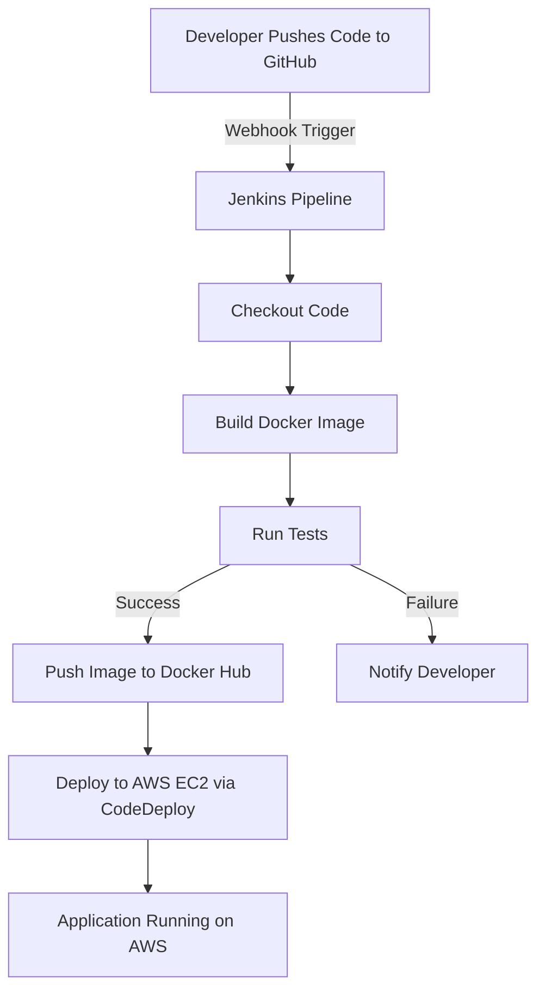

# Movie Recommender System with Flask and CI/CD

## Overview

This project is a Movie Recommender System built using Flask, a lightweight Python web framework. It features a CI/CD pipeline using Jenkins, GitHub, and AWS to automate building, testing, and deploying the application whenever changes are pushed to the repository.

## Features

- Recommends movies based on user preferences using a Flask-based web interface.
- Automated CI/CD pipeline integrated with GitHub and AWS.
- Dockerized application for consistent deployment across environments.
- Scalable deployment on AWS EC2 with AWS CodeDeploy.

## Prerequisites

- **Docker**: Installed on the build and deployment environment.
- **Jenkins**: Server configured with Docker Pipeline, GitHub Integration, and AWS CodeDeploy plugins.
- **AWS CLI**: Configured with appropriate credentials for EC2 and CodeDeploy.
- **GitHub Repository**: Access to the repository with webhook configured for Jenkins.
- **Python 3.8+**: Required for local development and testing.
- **Flask**: Used as the web framework for the application.

## Installation

1. **Clone the Repository**:

   ```bash
   git clone https://github.com/MohamedAmineAffes/MovieRecommenderSystemCICD.git
   cd MovieRecommenderSystemCICD
   ```
2. **Set Up a Virtual Environment** (optional for local development):

   ```bash
   python3 -m venv venv
   source venv/bin/activate  # On Windows: venv\Scripts\activate
   pip install -r requirements.txt
   ```
3. **Build the Docker Image**:

   ```bash
   docker build -t movie-recommender:latest .
   ```
4. **Run the Application Locally**:

   ```bash
   docker run -p 5000:5000 movie-recommender:latest
   ```

   Alternatively, run the Flask app directly:

   ```bash
   python app.py
   ```

## CI/CD Pipeline

The CI/CD pipeline automates the process of building, testing, and deploying the Flask application. Below is a diagram illustrating the pipeline:



- **Jenkinsfile**: Defines stages for Checkout, Build, Test, and Deploy.
- **Trigger**: Pipeline runs automatically on push to the `main` branch via GitHub webhook.
- **Deployment**: Deploys the Dockerized Flask application to an AWS EC2 instance using AWS CodeDeploy.

## Usage

- Access the application at `http://localhost:5000` for local development or at your AWS endpoint after deployment.
- Input user preferences via the Flask web interface to receive movie recommendations.
- Update the `Jenkinsfile`, Flask application code (`app.py`), or other files, push to GitHub, and monitor the pipeline execution in Jenkins.

## Project Structure

```plaintext
MovieRecommenderSystemCICD/
├── app.py                 # Main Flask application
├── requirements.txt       # Python dependencies
├── Dockerfile             # Docker configuration
├── Jenkinsfile            # CI/CD pipeline configuration
├── tests/                 # Test scripts
├── static/                # Static files (CSS, JS)
├── templates/             # HTML templates for Flask
└── README.md              # Project documentation
```

## Contributing

1. Fork the repository.
2. Create a feature branch:

   ```bash
   git checkout -b feature-branch
   ```
3. Commit changes:

   ```bash
   git commit -m "Add new feature"
   ```
4. Push to the branch:

   ```bash
   git push origin feature-branch
   ```
5. Open a pull request for review.

## Contact

For questions or support, contact Mohamed Amine Affes at mohamedamineaaffes@gmail.com